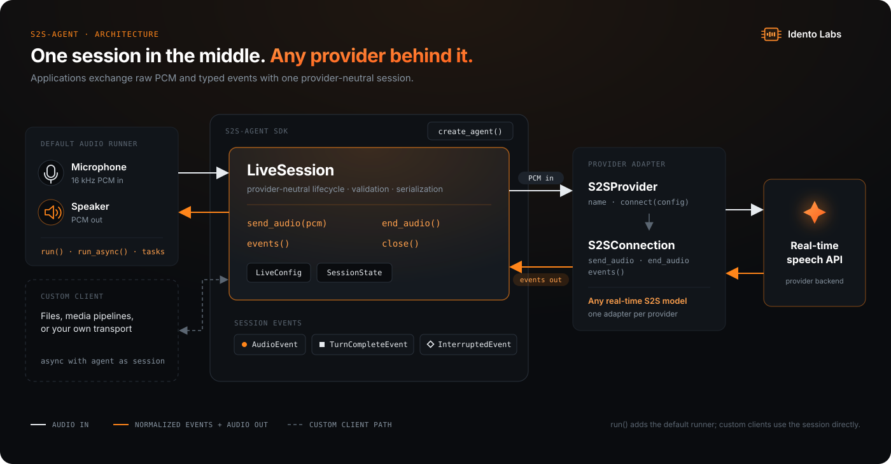

# Python SDK

> Build real-time speech-to-speech agents with `s2s-agent`.

[Website](https://aiminilabs0.github.io/s2s_agent/) ·
[Read the user guide](docs/overview.md)

## Install the SDK

```bash
git clone https://github.com/aiminilabs0/s2s_agent.git
cd s2s_agent
python -m pip install -e ".[audio]"
```

## Configure your API key

```bash
export GEMINI_API_KEY="your-api-key"
```

## Demo

```bash
python examples/talk.py
```

The default audio runner uses WebRTC AEC3 acoustic echo cancellation, so speaker
output is removed from microphone input while user interruptions remain
available. Customize the demo with `--model`, `--voice`, and `--instructions`.
If needed, pass `--echo-delay-ms N` as a speaker-to-microphone latency hint, or
use `--no-echo-cancellation` with headphones.

## SDK Usage

```python
agent = create_agent(
    model="your-s2s-model",
    voice="Kore",
    instructions="You are a concise and friendly voice assistant.",
)
agent.run()
```

## Providers

`create_agent()` uses Gemini and `GEMINI_API_KEY` by default. You can also
configure the provider explicitly:

```python
from s2s_agent import GeminiProvider, create_agent

provider = GeminiProvider(api_key="your-api-key", api_version="v1alpha")
agent = create_agent(provider=provider)
```

To add another real-time speech API, implement the `S2SProvider` and
`S2SConnection` protocols and pass your provider to `create_agent()`. See the
[provider guide](docs/overview.md#add-a-provider).

## Architecture


